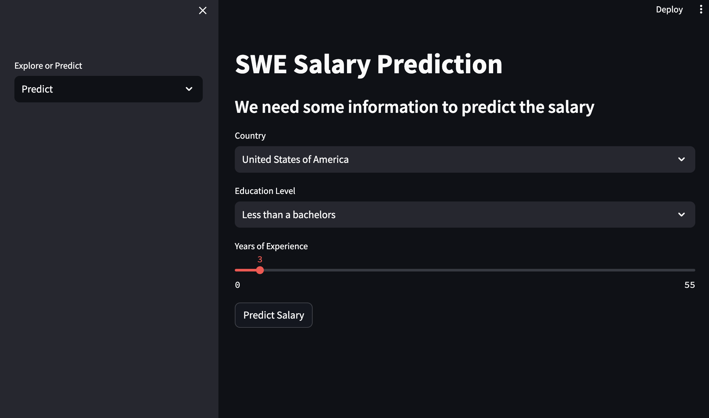
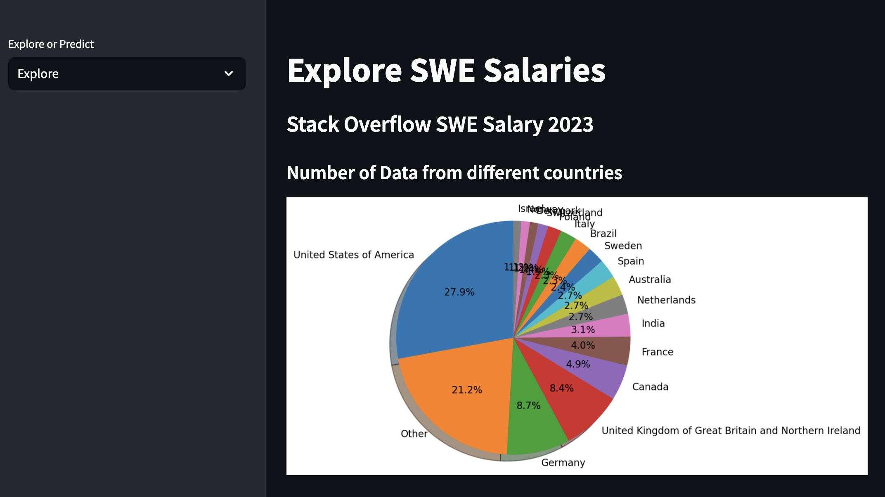

# SWE Salary Prediction and Exploration App

This is a Streamlit app that allows users to explore and predict salaries for software engineers (SWE) based on data from the Stack Overflow Developer Survey 2023. The app is built using Python and utilizes machine learning models for salary prediction.

## Features

1. **Salary Prediction**: Users can input their country, education level, and years of experience, and the app will predict their estimated salary based on a trained machine learning model.



2. **Salary Exploration**: The app provides visualizations to explore the salary data, including:

- Number of data points from different countries
- Mean salary based on country
- Mean salary based on years of experience



## Installation

1. Clone the repository:

```bash
git clone https://github.com/nanaagyei/ml-salary-prediction.git
```

2. Navigate to the project:

```bash
cd swe-salary-app
```

3. Install the required dependencies:

```bash
pip install -r requirement.txt
```

## Usage

1. Run the Streamlit app:

```bash
streamlit run app.py
```

2. The app will open in your default web browser. You can switch between the "Predict" and "Explore" pages using the sidebar.

3. On the "Predict" page, select your country, education level, and years of experience, then click the "Predict Salary" button to get the estimated salary.

4. On the "Explore" page, you can visualize the salary data based on different factors such as country and years of experience.

### File Structure

- `app.py`: The main file that runs the Streamlit app and handles page navigation.
- `explore_page.py`: Contains the code for the "Explore" page, including data loading and visualization functions.
- `predict_page.py`: Contains the code for the "Predict" page, including model loading and salary prediction.
- `data/survey_results_public.csv`: The dataset used for training the machine learning model and exploring the salary data.
- `saved_steps.pkl`: A pickle file containing the trained machine learning model and other necessary objects.

## Contributing

Contributions are welcome! If oyu find any issues or have suggestions for improvements, please open an issue or submit a pull request.
